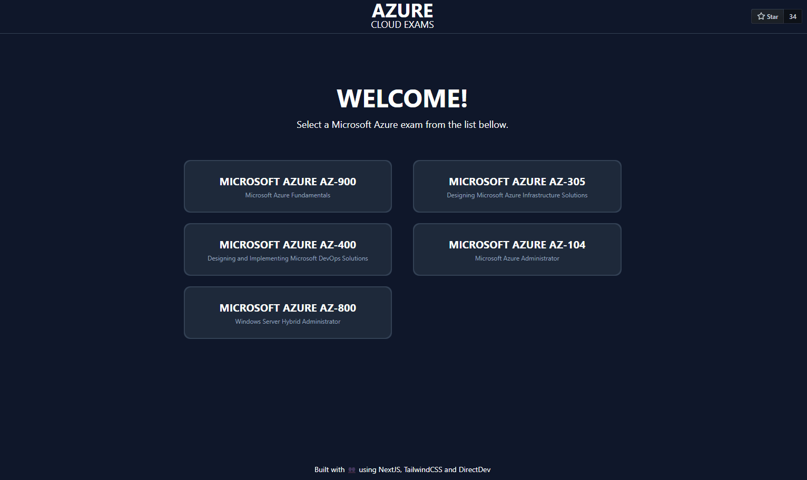

<h1 align="center">🧪 Practice Exams Platform</h1>
<br />

<div align="center">
This is a web application built with Next.js, TypeScript, CosmosDB, GraphQL and TailwindCSS. The application is a quiz
that tests your knowledge of Azure fundamentals, specifically for the AZ-900 certification exam. The questions are
stored in a Cosmos DB database and retrieved using GraphQL queries. The application is deployed on Microsoft Azure.

IMPORTANT: do not delete commented out code related to CosmosDB. We might use it to store questions soon in the future instead of from the repositories. Additionally, for the same reason let's keep Azure deployment, with that, the usage of NoSQL (CosmosDB) database is practically ready after commenting out some lines of code.

</div>

<br />


<div align="center">
<br />

[](../../graphs/contributors)
[](../../issues)
[](../../pulls)
<br>
[](LICENSE)
[](../../Practice-Exams-Platform/stargazers)

</div>

## Explanations

It's possible to have them generated using [Ollama](https://ollama.com). For installation please follow https://webinstall.dev/ollama/. Whether you want to generate explanations while running the platform on `localhost`, or on `education.ditectrev.com` it's possible. For the latter, please run `OLLAMA_ORIGINS="https://education.ditectrev.com" ollama serve` and refresh the https://education.ditectrev.com page. Facing `127.0.0.1:11434: bind: address already in use`? Fix it using https://github.com/ollama/ollama/issues/707.

## 🌟 Features

- Question sets scrapped from this
  [repo](https://github.com/Ditectrev).
- Correct answer displayed for each question.
- Practice mode & Exam mode.

## 🌱 Getting Started

Clone the repository:

```bash
git clone https://github.com/Ditectrev/Practice-Exams-Platform.git
```

Install dependencies:

```bash
npm install
```

Enable Git hooks:

```bash
npm run prepare
```

Run the app:

```bash
npm run dev
```

Open your browser and navigate to [http://localhost:3000](http://localhost:3000).

## Star History

<a href="https://star-history.com/#Ditectrev/Practice-Exams-Platform&Date">
  <picture>
    <source media="(prefers-color-scheme: dark)" srcset="https://api.star-history.com/svg?repos=Ditectrev/Practice-Exams-Platform&type=Date&theme=dark" />
    <source media="(prefers-color-scheme: light)" srcset="https://api.star-history.com/svg?repos=Ditectrev/Practice-Exams-Platform&type=Date" />
    
  </picture>
</a>

## 👥 Contributing

I welcome feedback and contributions from other developers, which can help improve the quality of the code and the
application overall.

In order to create an issue or a pull request with your changes, please read
[our contribution guidelines](CONTRIBUTING.md), and thank you for being involved!

There is also a [Discussion tab](../../discussions)

For a full list of all authors and contributors, see
[the contributors page](../../contributors).

## 📜 License

This project is licensed under the MIT License - see the [LICENSE](LICENSE) file for details.
